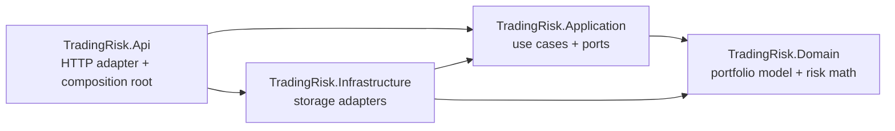

# Trading Risk Engine learning project

This repository is a guided bridge from Java/Spring Boot to C# 14, .NET 10, and
ASP.NET Core. It starts as a production-shaped modular monolith: small enough to
understand in one sitting, but separated into the same boundaries used by many
large systems.

The implemented vertical slice lets you:

1. create an immutable long/short portfolio;
2. submit historical daily returns;
3. calculate historical Value at Risk (VaR), Expected Shortfall (ES), worst loss,
   daily P&L volatility, and annualized P&L volatility;
4. explore that workflow in a responsive browser workbench;
5. observe validation and errors through standard HTTP Problem Details; and
6. test the domain, application handler, static UI, and complete HTTP flow.

This is an educational risk engine, not a trading or regulatory system. Its
linear P&L approximation is intentionally transparent and is unsuitable for
options and other nonlinear instruments.

## Learning manual

The documentation is written as a Java/Spring-to-.NET course around the running
code. Use this study order:

1. [Learning path](docs/00-learning-path.md)
2. [Java/Spring to C#/.NET map](docs/01-java-to-csharp-dotnet.md)
3. [Build, dependencies, startup, and packaging deep dive](docs/05-build-dependencies-startup-and-packaging.md)
4. [Architecture and every-file guide](docs/02-architecture-and-file-guide.md)
5. [Architecture and domain-design deep dive](docs/07-architecture-and-domain-design-deep-dive.md)
6. [ASP.NET Core web API deep dive](docs/08-aspnet-core-web-api-deep-dive.md)
7. [Browser UI deep dive](docs/11-browser-ui-deep-dive.md)
8. [Risk metrics and finance deep dive](docs/03-risk-metrics.md)
9. [.NET and risk testing deep dive](docs/09-testing-dotnet-and-risk-deep-dive.md)
10. [GitHub-rendered Mermaid diagrams](docs/06-mermaid-diagrams.md)
11. [Production-scale .NET deep dive](docs/10-production-scale-dotnet-deep-dive.md)
12. [Hands-on exercises](docs/04-exercises.md)

The C# and project files also contain teaching comments at decisions where a
Spring developer is likely to ask “why,” while the docs hold the fuller
explanations and Java comparisons.

## Architecture



Dependency arrows point inward. The domain knows nothing about ASP.NET Core,
databases, JSON, logging, or dependency injection.

## Prerequisites and commands

Install the [.NET 10 SDK](https://dotnet.microsoft.com/download/dotnet/10.0),
then verify it:

```bash
dotnet --version
dotnet restore RiskEngine.slnx
dotnet build RiskEngine.slnx
dotnet test RiskEngine.slnx
dotnet run --project src/TradingRisk.Api --launch-profile http
```

The original machine did not have `dotnet` installed when this project was
created. `global.json` accepts current .NET 10 feature bands, but your first
real team project should target exactly the runtime and SDK policy used by that
team.

Once running:

- browser risk workbench: `http://localhost:5229/`
- health: `http://localhost:5229/health`
- OpenAPI document in Development: `http://localhost:5229/openapi/v1.json`
- runnable request collection:
  [`TradingRisk.Api.http`](src/TradingRisk.Api/TradingRisk.Api.http)

The browser workbench guides you through creating a portfolio, entering a
historical return matrix, and interpreting the calculated distribution. It
calls the same API documented by the `.http` file; the JavaScript does not
reimplement the risk formulas. If you use the request collection instead,
create a portfolio first, copy its returned ID into the `.http` file, and then
run the risk request. Storage is currently in memory, so restarting the API
removes all portfolios.

## Container

```bash
docker build -t trading-risk-learning .
docker run --rm -p 8080:8080 trading-risk-learning
```

The browser workbench is then `http://localhost:8080/`, and the health endpoint
is `http://localhost:8080/health`.

## What is deliberately not implemented yet

The learning path turns these omissions into later milestones: PostgreSQL and
EF Core, transactions and optimistic concurrency, market-data ingestion,
background jobs and messaging, idempotency, an outbox, caching, authentication
and authorization, OpenTelemetry, resilience, load testing, advanced
instrument pricing, backtesting, and regulatory reporting.

That order is intentional: first understand a complete request and its domain
math; then replace one boundary at a time and measure the consequences.
