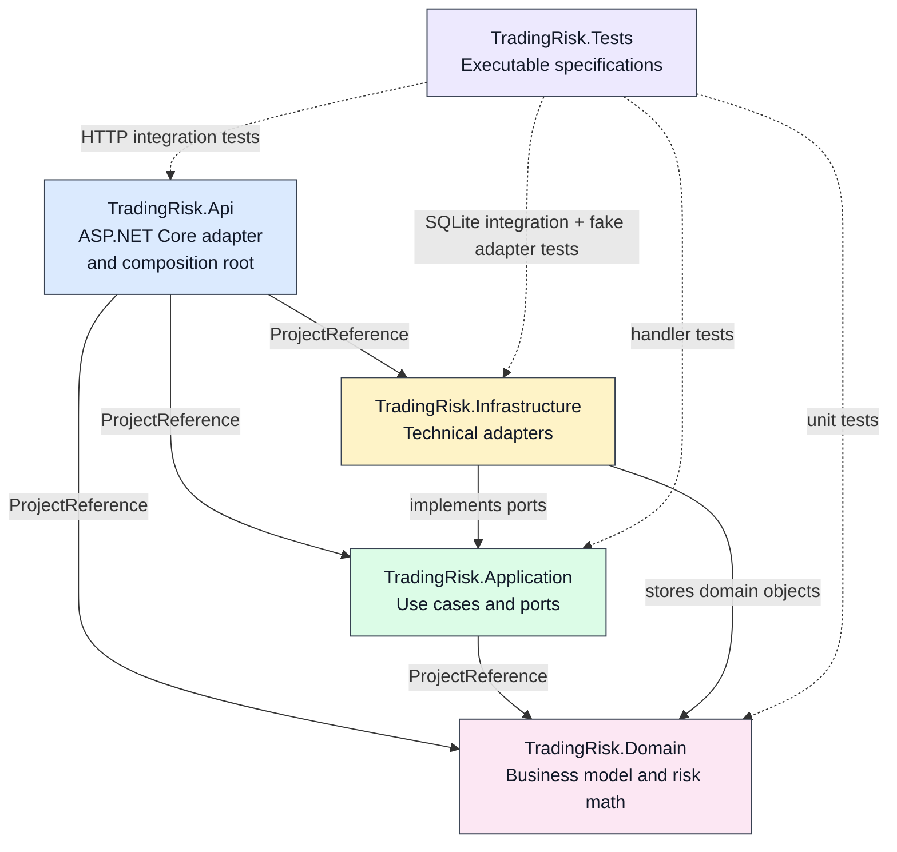
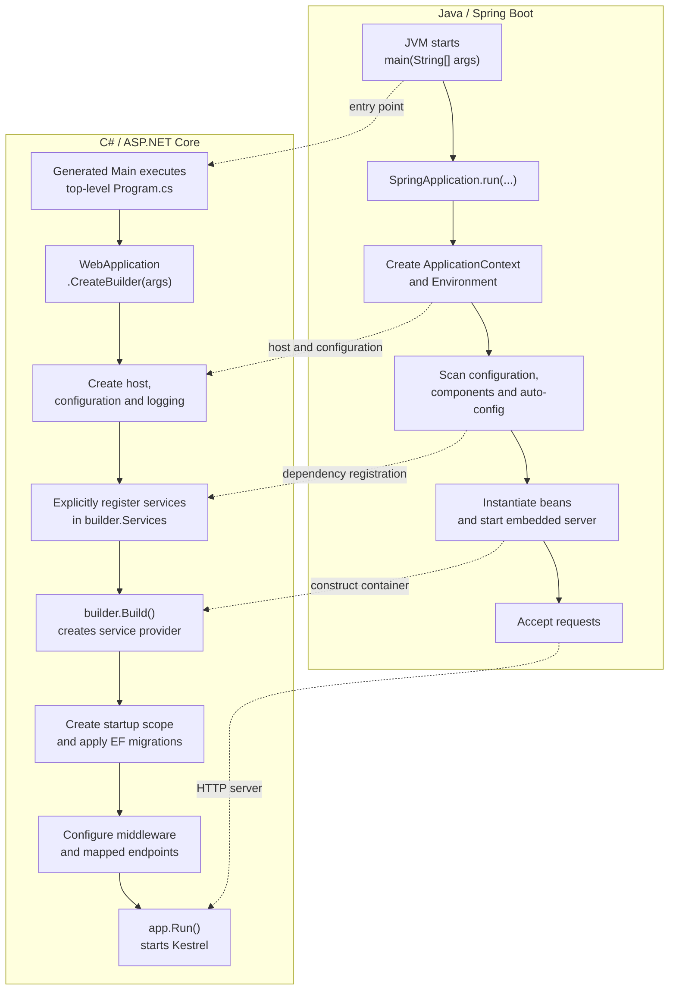
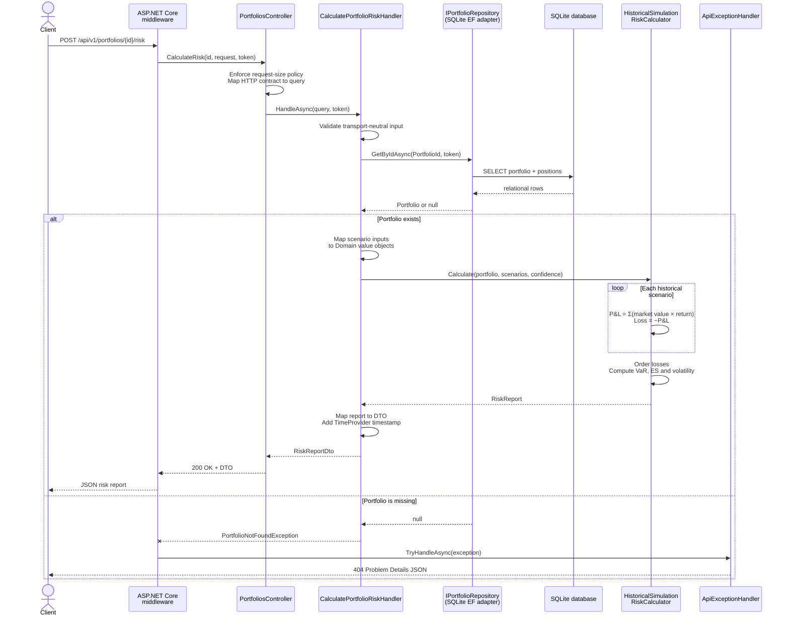
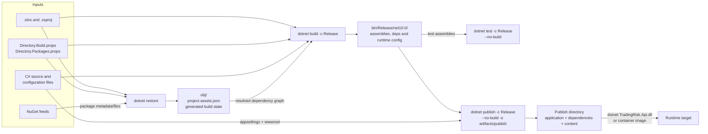
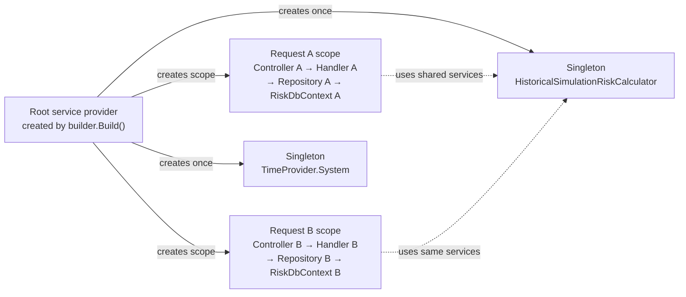
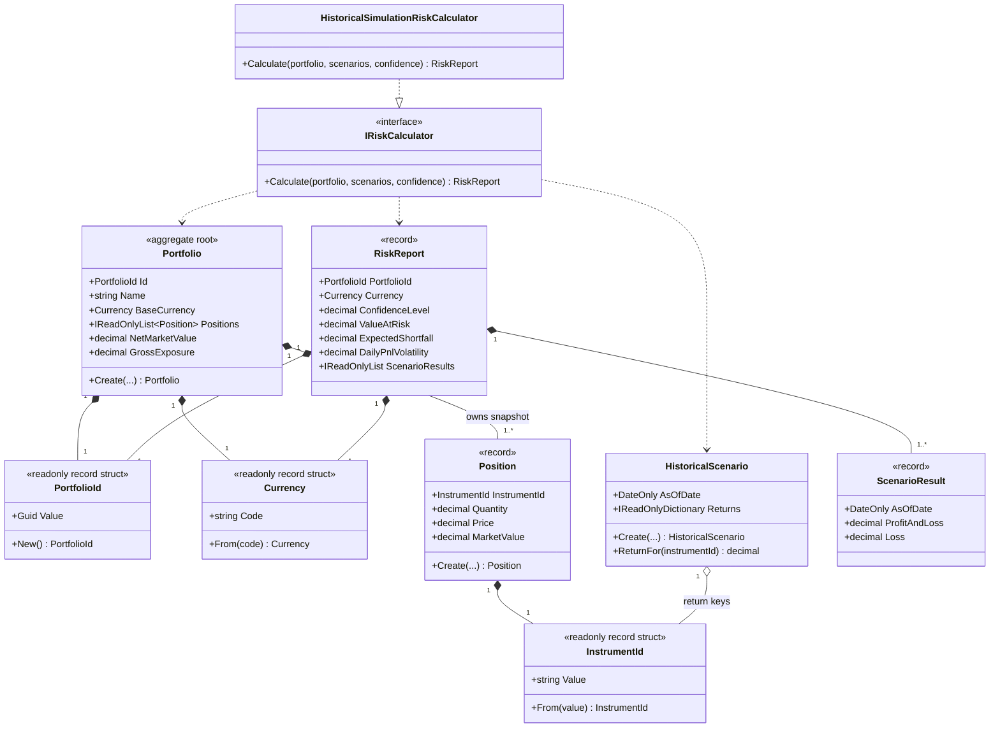
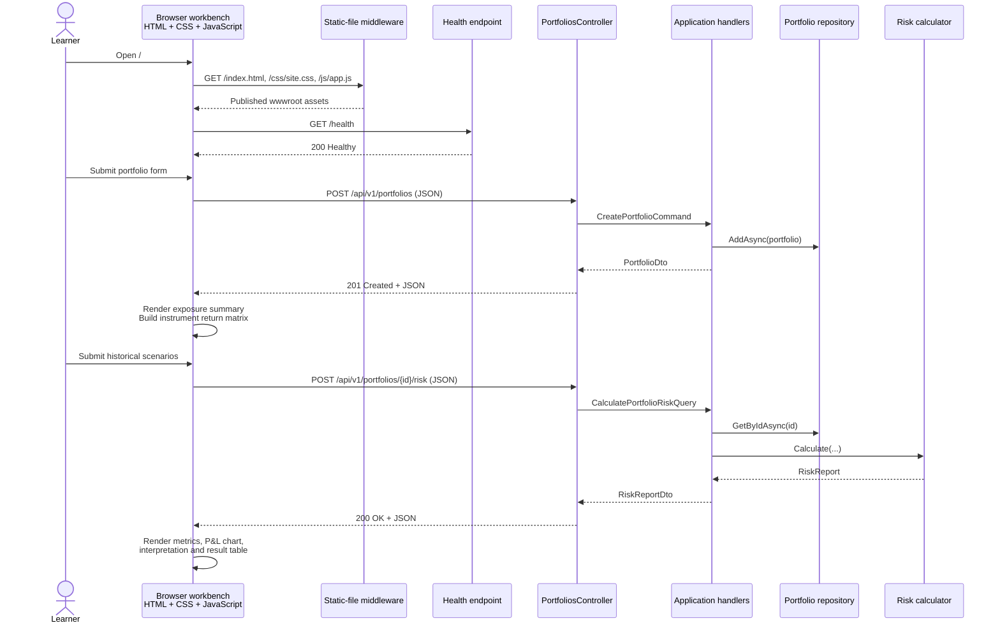
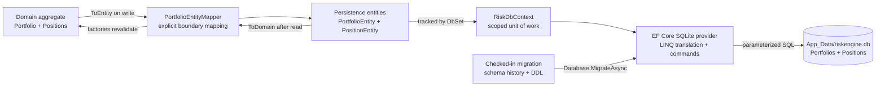
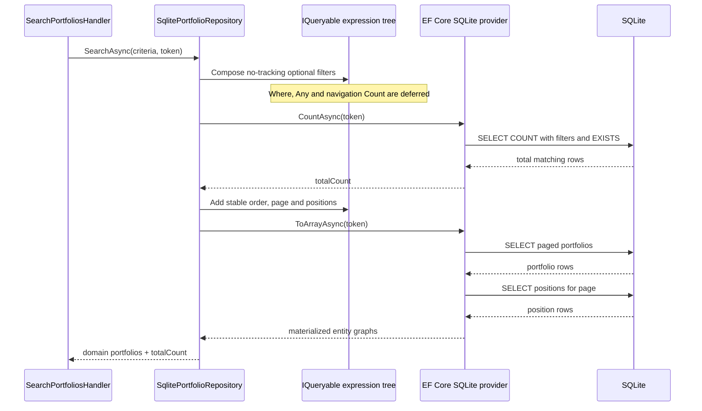
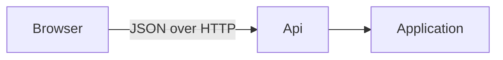

# Mermaid architecture and runtime diagrams

These diagrams live directly inside Markdown `mermaid` fences, so GitHub
renders them on the documentation page without a separate diagram plugin,
server, generated image, or checked-in binary. The diagram source and its
explanation therefore change together in one reviewable file.

## Diagram index

| Diagram | Question it answers |
|---|---|
| [Component dependencies](#1-compile-time-component-dependencies) | Which `.csproj` may know which other project? |
| [Startup comparison](#2-startup-comparison) | What happens between the entry point and the HTTP server accepting requests? |
| [Risk request sequence](#3-risk-request-sequence) | Which runtime component handles a risk request and where do failures become HTTP? |
| [Build and publish](#4-build-and-publish) | How do source, restore state, build output, tests, and publish output relate? |
| [DI lifetimes](#5-dependency-injection-lifetimes) | Which objects are shared between requests and which belong to one request? |
| [Domain model](#6-domain-model) | How do portfolios, positions, scenarios, the calculator, and reports relate? |
| [Browser UI flow](#7-browser-ui-flow) | How does the static browser workbench call the same ASP.NET Core API? |
| [EF Core persistence](#8-ef-core-persistence) | How do domain objects cross the EF/SQLite boundary? |
| [LINQ query execution](#9-linq-query-execution) | When does a composed LINQ expression become SQL and materialized objects? |

## 1. Compile-time component dependencies



A solid arrow means the source project has a compile-time dependency on the
target, normally created by `<ProjectReference>`.

The central rule is that dependencies point inward toward business policy.
Domain has no reverse project or NuGet dependency, so it cannot accidentally
use controllers, repositories, configuration, or ASP.NET Core. Dashed test
arrows do not make production code depend on tests.

## 2. Startup comparison



Both platforms enter user code, collect configuration/logging, describe
services, construct a dependency container, create an HTTP server, and listen
until shutdown.

Spring Boot commonly discovers much of its graph through component scanning,
configuration, and auto-configuration. This project registers application
services explicitly in `builder.Services`.

`builder.Build()` creates the configured application and root service provider;
it does not start listening. This learning service then creates a scope and
applies checked-in EF migrations. `app.Run()` starts Kestrel and waits for
shutdown. A replicated production deployment should migrate in a controlled
deployment step instead of making every replica race during startup.

## 3. Risk request sequence



Read sequence diagrams from top to bottom. Horizontal arrows are calls or
returned values; vertical lifelines are runtime participants; the loop repeats
for every historical observation; and the `alt` block separates success from
not-found behavior.

The controller understands HTTP, the handler understands a use case and ports,
and the calculator understands portfolio/risk types. A missing portfolio is an
Application exception until the outer handler maps it to HTTP 404.

The cancellation token travels into asynchronous repository work. The pure
CPU-bound calculator is synchronous because `async` would not make arithmetic
parallel or faster.

## 4. Build and publish



Keep three output concepts separate:

- `obj/` contains intermediate/generated state, including NuGet's resolved
  asset graph;
- `bin/` contains compiled project output;
- the publish directory is an assembled deployment layout.

Restore resolves, build compiles, test executes test assemblies, and publish
gathers application assemblies, dependencies, runtime metadata, configuration,
and static browser assets.

These commands can trigger previous stages implicitly. CI restores once, then
uses `--no-restore` and `--no-build` so each failure belongs to one stage.

## 5. Dependency-injection lifetimes



The root provider owns singletons until shutdown. ASP.NET Core creates a scope
for each request. Each request gets its own handler, EF repository, and
`DbContext`; both requests share the stateless calculator and system clock.
The repository implements two Application ports, but both interfaces resolve
to the same repository instance inside one scope.

`DbContext` is a short-lived unit of work and is not thread-safe. Do not share
it between requests or run parallel operations through one instance. The
calculator can be shared because it has no mutable state.

Transient services, if registered, are created whenever resolved. A singleton
must not capture a scoped service because that object could outlive the request
that owns it.

## 6. Domain model



Composition (`*--`) represents ownership. A portfolio owns an immutable
snapshot of positions; a risk report owns scenario results. The implementation
arrow (`..|>`) means the historical calculator implements the strategy
interface.

Small value types prevent values with different meanings from being mixed only
because both are a raw `Guid` or `string`. Factory methods validate before an
object is created. This is closer to Java records/value objects with static
factories than to mutable JPA entities.

The diagram is conceptual: private fields, constructors, some report fields,
and DTOs are omitted so relationships remain readable. C# is the exact
specification.

## 7. Browser UI flow



The UI is a same-origin adapter. ASP.NET Core serves its static files and the
browser calls relative `/api/...` URLs, so local development needs no separate
frontend server or CORS policy.

The browser does not calculate risk. It gathers input, serializes JSON, handles
Problem Details, and renders the server's DTO. Domain and Application remain
the source of business behavior.

## 8. EF Core persistence



The Domain project has no EF attributes or provider dependency. Infrastructure
owns mutable persistence entities, table mappings, migrations, and the explicit
mapper. That duplication is deliberate: a database row shape can evolve for
storage concerns without turning the validated domain aggregate into a mutable
ORM container.

The provider translates supported LINQ expression trees into parameterized SQL.
EF materializes entities from rows; the mapper then calls Domain factories so
invalid persisted data cannot silently enter the business model.

## 9. LINQ query execution



An `IQueryable<T>` is a recipe, not the results. Each operator returns a new
expression tree. The two terminal operations execute two database round trips:
one count for pagination metadata and one split materialization query (which
itself uses a portfolio command and a positions command). `Any` becomes SQL
`EXISTS`; navigation `Count` becomes a correlated SQL count; `Skip` and `Take`
become `OFFSET` and `LIMIT` for SQLite.

The stable `OrderBy(Name).ThenBy(Id)` is essential. SQL tables have no implicit
order, and offset pages can repeat or omit rows if ties have no unique
tie-breaker.

## How to edit Mermaid safely

GitHub renders a fenced block:

````text

````

Useful syntax:

- `flowchart LR` describes left-to-right dependencies;
- `sequenceDiagram` describes calls over time;
- `classDiagram` describes type relationships;
- `-->` is a solid dependency/call;
- `-.->` is a dashed dependency;
- `-->>` is a returned value in a sequence;
- `*--` is composition and `..|>` is interface implementation.

Use stable short identifiers such as `Application` and place the longer visible
label inside `["..."]`. When architecture changes, update the matching Mermaid
block in the same commit. GitHub's rendered preview is the normal review
surface; the fenced text remains the source of truth.
