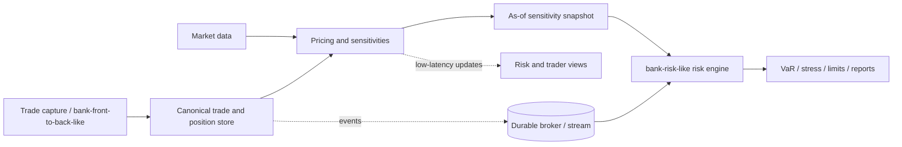

# bank-risk-inspired architecture, queues, and security

This chapter makes the learning project closer to the *shape* of a bank risk
platform without claiming to reproduce bank's private systems.

## What is publicly supported

Public bank disclosures describe **bank-front-to-back** as a front-office system
where trading transactions are booked and positions and sensitivities are
calculated. They describe **bank-risk** and AGRisk as market-risk calculation
systems, with VaR, stress, interest-rate and FX sensitivities consumed by risk
management. They do not publish the internal source code, broker, database,
latency SLOs, or deployment topology. Therefore the diagram below is a useful
industry learning target, not a claim about the production implementation.

Sources: [SG India financial statement 2020](https://www.societegenerale.asia/fileadmin/user_upload/Societe_Generale_websites/Asia/India/India_Financial_Annual_Reports/Financial_statement_for_the_year_ended_March_31_2020.pdf), [SG India financial statement 2025](https://www.societegenerale.asia/fileadmin/user_upload/Societe_Generale_websites/Asia/India/India_Financial_Annual_Reports/Financial_statement_for_the_year_ended_March_31_2025.pdf.pdf), and [SG risk governance](https://www.societegenerale.com/fr/groupe/conformite-risques/maitrise-risques).

## Target mental model

The important separation is between **pricing** (what is the position worth and
how does it react to a factor?) and **risk aggregation** (how do many positions,
scenarios, books, and limits combine?). This repository currently has a linear
position pricer and historical simulation aggregator. The new
`GET /api/v1/portfolios/{id}/analytics` endpoint exposes that seam: its `Delta`
is quantity for a linear instrument, while a future option pricer would provide
nonlinear Greeks.

## Queues and low latency

There is no reliable public evidence that bank-risk uses a particular queue
technology, so do not write “it uses Kafka” as a fact. In a real risk platform,
two paths commonly coexist:

| Path | Typical transport | Why |
| --- | --- | --- |
| current price, sensitivity, or small risk snapshot | synchronous RPC/HTTP/gRPC, in-memory caches | bounded latency and an immediate answer |
| market-data fan-out, recalculation, batch VaR, report generation | durable pub/sub or queue (Kafka, RabbitMQ, Azure Service Bus, etc.) | buffering, replay, scaling consumers, and recovery |

A queue does not automatically make a request low latency. It adds a hop and
usually gives **eventual consistency**. It is valuable when work is bursty or
expensive. The low-latency path normally reads a versioned, precomputed snapshot
and avoids recalculating every portfolio on every screen refresh.

For this sample, the original portfolio risk endpoint stays synchronous so the
formula is easy to follow. A second path now demonstrates a broker-like mechanism:
`POST /api/v1/risk-jobs` writes to a bounded
`System.Threading.Channels.Channel<T>`, `RiskJobWorker` consumes it as a hosted
background service, and `GET /api/v1/risk-jobs/{id}` exposes status/result. This
is deliberately in-memory: it demonstrates backpressure and worker isolation but
does not survive a restart or provide cross-instance delivery. Replace only the
`IRiskJobBroker` adapter with Kafka, RabbitMQ, IBM MQ, or an approved platform when
you are ready. Study partition keys, correlation IDs, idempotency keys,
as-of/versioned inputs, retry/dead-letter handling, and graceful shutdown before
making that replacement.

## Security implemented in this project

The API demonstrates the normal ASP.NET Core pipeline:

1. `AddAuthentication().AddJwtBearer(...)` validates a token's signature, issuer,
   audience, lifetime, and clock skew.
2. `UseAuthentication()` builds `HttpContext.User` from that token.
3. `[Authorize(Policy = "RiskReader")]` requires `risk-reader` or
   `risk-operator`; creating a portfolio additionally requires `risk-operator`.
4. `AuthController` mints a short-lived token only in Development/Testing so the
   browser and learner can run without an identity provider.

The demo endpoint is intentionally **not authentication**: it accepts a requested
role. It must never be enabled in production. A deployed service normally uses
OIDC/OAuth2, validates an issuer's rotating public keys, and receives roles/scopes
from that provider. Never commit a real signing key; use environment variables or
a secret manager, require HTTPS, restrict CORS, redact tokens from logs, and audit
privileged actions. EF Core parameterization protects normal LINQ queries, but
authorization and tenant/book filters still belong before the query.

Java comparison: Spring Security's `SecurityFilterChain` maps to ASP.NET Core
middleware plus registered schemes; `@PreAuthorize` maps to `[Authorize]` policy
attributes; `Authentication` maps to `HttpContext.User`; `application.yml`
properties map to `IOptions<SecurityOptions>`.

## Files and exercises

Study `Program.cs`, `Options/SecurityOptions.cs`, `Security/DemoTokenService.cs`,
`Controllers/AuthController.cs`, `Controllers/PortfoliosController.cs`, and
`Application/Portfolios/GetPortfolioAnalytics.cs`. The test authentication handler
replaces an external identity provider deterministically while authorization still
runs. Then add a reader-forbidden operator endpoint, a bounded `Channel<RiskJob>`,
durable job status, and finally an OIDC issuer with key rotation.
