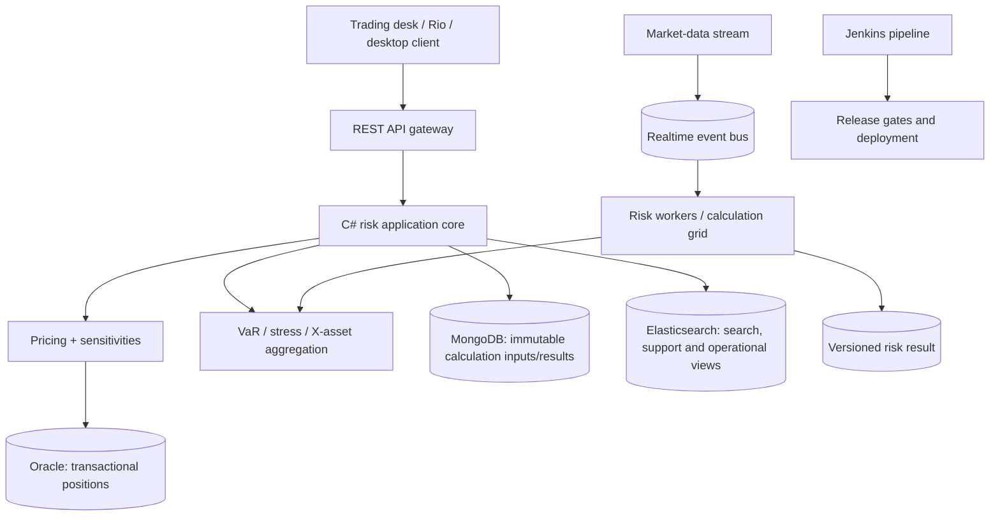

# Role-informed bank risk-platform roadmap

The role description is valuable because it identifies responsibilities and
technologies found in a large bank risk-platform team. It describes one person's
scope, not a complete authoritative architecture, so treat it as an engineering
signal rather than a specification.

## What it tells us about the target

| Role clue | What to learn in this project | Current status |
| --- | --- | --- |
| C# real-time FX risk and trader restitution UI | C# domain/application code, REST contract, result-oriented UI | core API and browser UI implemented |
| WinForms and WPF | desktop presentation patterns, MVVM, synchronization-context/UI-thread rules | documented exercise; not added because WPF is Windows-specific |
| large front-to-back platform | modular boundaries, stable contracts, release compatibility, ownership | modular monolith foundation |
| Core team: database, multithreading, memory, speed | profiling, allocation analysis, bounded concurrency, query plans | next performance milestone |
| Oracle SQL, MongoDB, ElasticSearch | polyglot persistence by workload, not “one database everywhere” | SQLite adapter today; target adapters documented below |
| Symphony calculation grid and load balancer | partitioning, worker leases, capacity, retries, deterministic aggregation | next distributed-risk exercise |
| MiFID II real-time architecture | event time, ordering, replay, audit trail, freshness/versioned snapshots | queue concepts documented; durable stream not yet implemented |
| TDD, Jenkins, Git, Jira | fast tests, CI gates, traceable releases, incident/change workflow | tests and local build implemented |
| worldwide L2/L3 support and releases | observability, runbooks, rollback, release coordination | operational exercises below |

## Recommended target architecture

This is a teaching target. Do not replace SQLite, add three databases, or add a
broker just for the appearance of scale. First measure the bottleneck and then
swap one adapter. The clean boundary is more important than the product name.

## Persistence by responsibility

* **Oracle/SQL** is a plausible system of record for trades, positions,
  reference data, and relational constraints. Learn indexes, execution plans,
  isolation, bind variables, connection pooling, and avoiding N+1 queries.
* **MongoDB** is a plausible document store for calculation-run inputs,
  versioned snapshots, or large irregular result payloads. Learn document shape,
  indexes, atomic document updates, and the trade-off between embedding and
  references.
* **Elasticsearch** is a plausible read/search/operations projection. It is not
  the authoritative source for a trade. Learn mappings, refresh latency,
  analyzers, aliases, retention, and handling eventual consistency.

The current EF Core repository intentionally uses SQLite so the examples run on
your laptop. A useful exercise is to keep `IPortfolioRepository` unchanged while
adding an Oracle implementation and an integration test against a disposable
database. This is the .NET equivalent of hiding a JPA repository behind an
application port, but the SQL provider's translation and locking behavior must
still be measured.

## Real-time means more than “use a queue”

For MiFID II-style or trader-facing updates, define the contract first:

1. every event has an ID, event time, source, instrument/book key, and schema version;
2. consumers record the last processed version and are idempotent;
3. a calculation result records the exact position and market-data versions used;
4. stale results are marked stale rather than silently displayed as current;
5. a replay can rebuild a result after a worker or database failure.

Use a synchronous call for a bounded request that needs an answer immediately.
Use a stream/broker for fan-out and replay. Use a bounded in-process
`Channel<T>` to learn the worker pattern, then an adapter for Kafka, IBM MQ, or
another approved platform. Queue choice is an infrastructure decision; ordering,
freshness, idempotency, and observability are the core design.

## Performance curriculum

Measure before and after each change:

* `dotnet-counters` for CPU, allocation rate, GC pauses, thread-pool starvation;
* `dotnet-trace`/PerfView for hot methods and lock contention;
* BenchmarkDotNet for pricing and aggregation microbenchmarks;
* EF logging and database execution plans for round-trips and scans;
* load tests for p50/p95/p99 latency, throughput, queue depth, and error rate.

Then practise: cache immutable market-data snapshots, project only needed SQL
columns, avoid materializing huge LINQ graphs, use bounded parallelism, partition
scenarios across workers, aggregate deterministically, and put a timeout around
each remote dependency. Do not use `Task.Run` as a substitute for an architecture
or create unbounded parallel work.

## Release and support curriculum

Add a Jenkins-equivalent pipeline with these gates:

1. restore with locked package versions and vulnerability checks;
2. format/analyzer/build;
3. unit, integration, and non-regression risk fixtures;
4. API compatibility/OpenAPI diff;
5. container/image scan and deployment smoke test;
6. canary/rollback decision with dashboards and a runbook.

For an incident, practise correlation IDs, structured logs, metrics, traces,
health checks, a calculation input/result ID, and a safe replay. A second- or
third-level support engineer should be able to answer: “Which release, worker,
market-data version, and database query produced this number?”

## Desktop clients: why they are not in the default build

WinForms is event-driven and control-oriented; WPF commonly uses XAML, data
binding, commands, and MVVM. Both can call the same REST API and application
contracts, but WPF desktop builds are Windows-specific. The browser workbench is
kept as the portable client. A good exercise is a separate Windows `net10.0-windows`
WPF project that references only shared contracts and an HTTP client—not the
domain or EF context—and displays a live sensitivity snapshot.

## Suggested next sequence

1. Replace the implemented bounded `Channel<RiskJob>` plus `BackgroundService`
   with a durable broker adapter and job status store.
2. Add idempotency and versioned input snapshots.
3. Add OpenTelemetry traces and a latency/queue-depth dashboard.
4. Benchmark the calculator and optimize one measured hotspot.
5. Add a Mongo-like calculation-result adapter and an Elasticsearch-like search
   projection behind interfaces (use test doubles first).
6. Add a Windows-only WPF client as a separate solution project.
7. Add CI gates and a release/runbook simulation.
